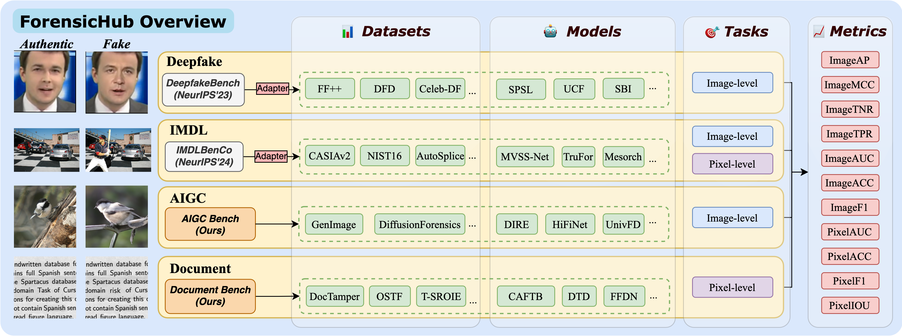

<p align="center" width="100%">

</p>

# [NeurlPS 2025] ForensicHub: A Unified Benchmark & Codebase for All-Domain Fake Image Detection and Localization

<div align="center">

[Bo Du](https://github.com/dddb11)†,    [Xuekang Zhu](https://github.com/Inkyl)†, [Xiaochen Ma](https://ma.xiaochen.world/)†,    [Chenfan Qu](https://github.com/qcf-568)†, Kaiwen Feng†, Zhe Yang  
[Chi-Man Pun](https://cmpun.github.io/),    Jian Liu*, [Jizhe Zhou](https://knightzjz.github.io/)*   

<div align="center"><span style="font-size: smaller;">
<br>†: joint first author & equal contribution
*: corresponding author</br>  
</div>  
</div>


******
[](https://arxiv.org/abs/2505.11003)
[](https://scu-zjz.github.io/ForensicHub-doc/)

<!----
[](https://GitHub.com/scu-zjz/) 
---->
🙋‍♂️Welcome to **ForensicHub**!   

ForensicHub is the go-to benchmark and modular codebase for all-domain fake image detection and localization,
covering deepfake detection (Deepfake), image manipulation detection and localization (IMDL), artificial
intelligence-generated image detection (AIGC), and document image manipulation localization (Doc). Whether you're
benchmarking forensic models or building your own cross-domain pipelines, **ForensicHub** offers a flexible, configuration-driven
architecture to streamline development, comparison, and analysis.

## 🏆 FIDL Leaderboard 🏆

We make the FIDL leaderboard for unified ranking model's generalization across all domains. See [here](https://scu-zjz.github.io/ForensicHub-doc/rank/fidl_rank.html) for more details.

<div align="center">

| 🏆 Rank |     Model      | Deepfake 🖼️ | IMDL 📝 | AIGC 🤖 | Doc 📄 | Avg ⭐ |
|:-------:|:--------------:|:---:|:---:|:---:|:---:|:---:|
|  🥇 1   |     Effort     | 0.614 | 0.587 | 0.410 | 0.704 | 0.579 |
|  🥈 2   |     UnivFD     | 0.534 | 0.486 | 0.463 | 0.699 | 0.545 |
|  🥉 3   | ConvNeXT-small | 0.662 | 0.704 | 0.337 | 0.466 | 0.542 |
|    4    |  Segformer-b3  | 0.596 | 0.567 | 0.342 | 0.334 | 0.460 |
|   ...   |

</div>

## 🚤Update
- [2025.7.17] Released some missing pretrain weights for DocTamper Detection models, see this [issue](https://github.com/scu-zjz/ForensicHub/issues/9) for details.
- [2025.7.11] We update to a *lazy-load version* of MODEL and POSTFUNC. The package will be checked when the model is actually used, which reduces unnecessary package installation. 
- [2025.7.10] Add a script for single image inference, see [Code](https://github.com/scu-zjz/ForensicHub/blob/master/ForensicHub/training_scripts/inference.py).
- [2025.7.6] Add a new AIGC model, [FatFormer](https://arxiv.org/abs/2312.16649), see [Code](https://github.com/scu-zjz/ForensicHub/tree/master/ForensicHub/tasks/aigc/models/fatformer).
- [2025.7.1] Add document of Data Preparation & JSON Generation and Running Training & Evaluation in ForensicHub, see [Data Preparation](https://scu-zjz.github.io/ForensicHub-doc/guide/quickstart/3_data_preparation.html) and [Running Evaluation](https://scu-zjz.github.io/ForensicHub-doc/guide/quickstart/4_Running_Evaluation.html).
- [2025.6.22] Add summary of models and evaluators in ForensicHub, see [Document](https://scu-zjz.github.io/ForensicHub-doc/zh/summary/model.html).
- [2025.6.16] Add detailed installation and YAML configuration, see [Document](https://scu-zjz.github.io/ForensicHub-doc/zh/guide/quickstart/0_install.html).
- [2025.6.14] Add four new backbones: UNet, ViT, MobileNet, and DenseNet. More backbones are ongoing!


## 👨‍💻 About
☑️**About the Developers:**  
- ForensicHub's project leader/supervisor is Associate Professor 🏀[_Jizhe Zhou_ (周吉喆)](https://knightzjz.github.io/), Sichuan University🇨🇳, and _Jian Liu_ (刘健), the Leader of the Computer Vision Algorithm Research Group, Ant Group Company Ltd.   
- ForensicHub's codebase designer and coding leader is [_Bo Du_ (杜博)](https://github.com/dddb11), Sichuan University🇨🇳.  
- ForensicHub is jointly sponsored and advised by Prof. _Jiancheng LV_ (吕建成), Sichuan University 🐼, and Prof. _Chi-Man PUN_ (潘治文), University of Macau 🇲🇴, through the [Research Center of Machine Learning and Industry Intelligence, China MOE](https://center.dicalab.cn/) platform.  

## 📦 Resources
You can find the resources of models under IFF-Protocol, including [checkpoints](https://pan.baidu.com/s/1gER6MYt30ghrKQT0Nu182g?pwd=brir) (or [onedrive](https://1drv.ms/f/c/090693aab65eb63b/Eo6tl6ktl4BLkQjqjwqXRhYB5nNt_Sni5Nx6KMC4DDJPnw?e=vayq2E)), [training parameters](https://github.com/scu-zjz/ForensicHub/tree/master/ForensicHub/statics/crossdataset_image), and [hardware specifications](https://arxiv.org/pdf/2505.11003).

Checkpoints for Document Benchmark: https://pan.baidu.com/s/13ViyJebu12I0GN3BucBQrg?pwd=npkx or https://drive.google.com/drive/folders/1RZZxwYIX5e-lHKDw1CD45FwFC0QqJ7im?usp=sharing

Checkpoints for AIGC Benchmark: https://pan.baidu.com/s/11Jr2wjp6lAz9IBNWnbHlVg?pwd=kzhf or https://drive.google.com/drive/folders/1M-qe5xOblVZgKiBQ9j1Q-GQ4ao5VJMHZ?usp=sharing

Pretrained backbone weights for Document models: https://pan.baidu.com/s/1lsArVWzcJiADUcYYeqyClw?pwd=4gf4 or https://drive.google.com/drive/folders/1NiHeRAcG2VkoN-JFgV5O_4YynQFiQWUw?usp=sharing. Place the checkpoint under the corresponding model’s folder.

## 🕵️‍♂️ Architecture   
**ForensicHub provides four core modular components:** 

### 🗂️ Datasets

Datasets handle the data loading process and are required to return fields that conform to the ForensicHub
specification.

### 🔧 Transforms

Transforms handle the data pre-processing and augmentation for different tasks.

### 🧠 Models

Models, through alignment with Datasets and unified output, allow for the inclusion of various
state-of-the-art image forensic models.

### 📊 Evaluators

Evaluators cover commonly used image- and pixel-level metrics for different tasks, and are implemented with GPU
acceleration to improve evaluation efficiency during training and testing.



## 📁 Project Structure Overview

```bash
ForensicHub/
├── common/                 # Common modules
│   ├── backbones/          # Backbones and feature extractors
│   ├── evalaution/         # Image- and pixel-level evaluators
│   ├── utils/              # Utilities
│   └── wrapper/            # Wrappers for dataset, model, etc.
├── core/                   # Core module providing abstract base classes
├── statics/                # YAML configuration files for training and testing
├── tasks/                  # Components for different sub-tasks
│   ├── aigc/           
│   ├── deepfake/             
│   ├── document/            
│   └── imdl/     
└── training_scripts        # Scripts for training and evaluation
```

## 📀Installation

---

We recommend cloning the project locally.

### 📉Clone

Simply run the following command:

```
git clone https://github.com/scu-zjz/ForensicHub.git
```
Also, since ForensicHub is compatible with DeepfakeBench (which hasn’t been uploaded to PyPI), you’ll need to clone our forked version [Site](https://github.com/scu-zjz/DeepfakeBench) locally and install it using: `pip install -e .`.

## 🎯Quick Start

---

The Quick Start example is based on the local clone setup. ForensicHub is a modular and configuration-driven lightweight
framework. You only need to use the built-in or custom Dataset, Transform, and Model components, register them, and then
launch the pipeline using a YAML configuration file.

<details>
<summary>Training on the DiffusionForensics dataset using Resnet for AIGC</summary>

1. Dataset Preparation

Download the DiffusionForensics dataset from (https://github.com/ZhendongWang6/DIRE).
The experiment only uses the ImageNet portion. Format the data as JSON. ForensicHub does not restrict how the data is
loaded—just make sure the Dataset returns fields as defined in `\core\base_dataset.py`. This means users are free to
implement their own loading logic. In this case, we
use `/tasks/aigc/datasets/label_dataset.py`, which expects a JSON with entries like with label of 0 and 1 representing a
image of real and generated:

```
[
  {
    "path": "/mnt/data3/public_datasets/AIGC/DiffusionForensics/images/train/imagenet/real/n03982430/ILSVRC2012_val_00039791.JPEG",
    "label": 0
  },
  {
    "path": "/mnt/data3/public_datasets/AIGC/DiffusionForensics/images/train/imagenet/real/n03982430/ILSVRC2012_val_00022594.JPEG",
    "label": 0
  },
  ...
]
```

2. Component Preparation

In this example, the **Model** is ResNet50, which is already registered in `/common/backbones/resnet.py`, so no extra
code is needed. **Transform** is also pre-registered and available in `/tasks/aigc/transforms/aigc_transforms.py`,
providing basic
augmentations and ImageNet-standard normalization.

3. YAML Config & Training

ForensicHub supports lightweight configuration via YAML files. In this example, aside from data preparation, no
additional code is required.
Here is a sample training YAML `/statics/aigc/resnet_train.yaml`. The four components-**Model, Dataset, Transform,
Evaluator**-are all initiated
via `init_config`：

```shell
# DDP
gpus: "4,5"
flag: train

# Log
log_dir: "./log/aigc_resnet_df_train"

# Task
if_predict_label: true
if_predict_mask: false

# Model
model:
  name: Resnet50
  # Model specific setting
  init_config:
    pretrained: true
    num_classes: 1

# Train dataset
train_dataset:
  name: AIGCLabelDataset
  dataset_name: DiffusionForensics_train
  init_config:
    image_size: 224
    path: /mnt/data1/public_datasets/AIGC/DiffusionForensics/images/train.json
#  Test dataset (one or many)
test_dataset:
  - name: AIGCLabelDataset
    dataset_name: DiffusionForensics_val
    init_config:
      image_size: 224
      path: /mnt/data1/public_datasets/AIGC/DiffusionForensics/images/val.json

# Transform
transform:
  name: AIGCTransform

# Evaluators
evaluator:
  - name: ImageF1
    init_config:
      threshold: 0.5

# Training related
batch_size: 768
test_batch_size: 128
epochs: 20
accum_iter: 1
record_epoch: 0  # Save the best only after record epoch.

# Test related
no_model_eval: false
test_period: 1

# Logging & TensorBoard
log_per_epoch_count: 20

# DDP & AMP settings
find_unused_parameters: false
use_amp: true

# Optimizer parameters
weight_decay: 0.05
lr: 1e-4
blr: 0.001
min_lr: 1e-5
warmup_epochs: 1

# Device and training control
device: "cuda"
seed: 42
resume: ""
start_epoch: 0
num_workers: 8
pin_mem: true

# Distributed training parameters
world_size: 1
local_rank: -1
dist_on_itp: false
dist_url: "env://"
```

After creating the YAML file, you can launch training using `statics/run.sh` after updating file paths. You can also
use `statics/batch_run.sh` for batch experiments, which internally invokes multiple `run.sh` scripts. Testing works
similarly and only requires configuring the same four components.


</details>


## Citation

```
@misc{du2025forensichubunifiedbenchmark,
      title={ForensicHub: A Unified Benchmark & Codebase for All-Domain Fake Image Detection and Localization}, 
      author={Bo Du and Xuekang Zhu and Xiaochen Ma and Chenfan Qu and Kaiwen Feng and Zhe Yang and Chi-Man Pun and Jian Liu and Jizhe Zhou},
      year={2025},
      eprint={2505.11003},
      archivePrefix={arXiv},
      primaryClass={cs.CV},
      url={https://arxiv.org/abs/2505.11003}, 
}
```
